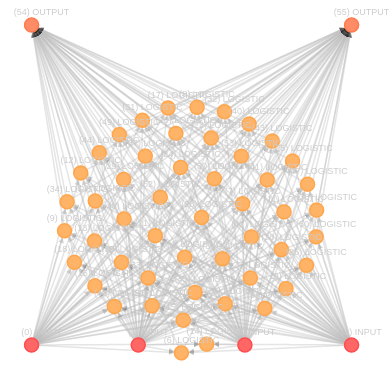

# Breast Cancer classification with Neural Network Artifical 

### What is Neural Network?
Artificial neural networks are computing systems inspired by the biological neural networks that constitute animal brain. 

### Neural Network with structure MLP - Multi Layer Perceptron
* Neurons number on input layer: 4
* Neurons number on hidden layer: 50
* Neurons number on input layer: 2
* Acttivation function: LeakyReLU (on hidden layer) and Sigmoid (output layer)
* Learning rate: 0.00003

### URL Dataset
[Breast Cancer Winsconsin (Diagnostic) Data set](https://archive.ics.uci.edu/ml/machine-learning-databases/breast-cancer-wisconsin/breast-cancer-wisconsin.data), from UCI - Machine Learning Repository 

#### Used columns in the heatmap above 
Attribute | Abbreviation
------------ | -------------
Clump Thickness              | CT
Uniformity of Cell Size      | UCS 
Uniformity of Cell Shape     | UC
Marginal Adhesion            | MA
Single Epithelial Cell Size  | SECS
Bare Nuclei                  | BN
Bland Chromatin              | BC
Normal Nucleoli              | NN
Mitoses                      | M
  
### Usage
    python3 test.py
    
* **Colaborators**
  * [Émerson Silva](https://github.com/SilvaEmerson)
  * [Luís Eduardo](https://github.com/luiseduardogfranca) 

